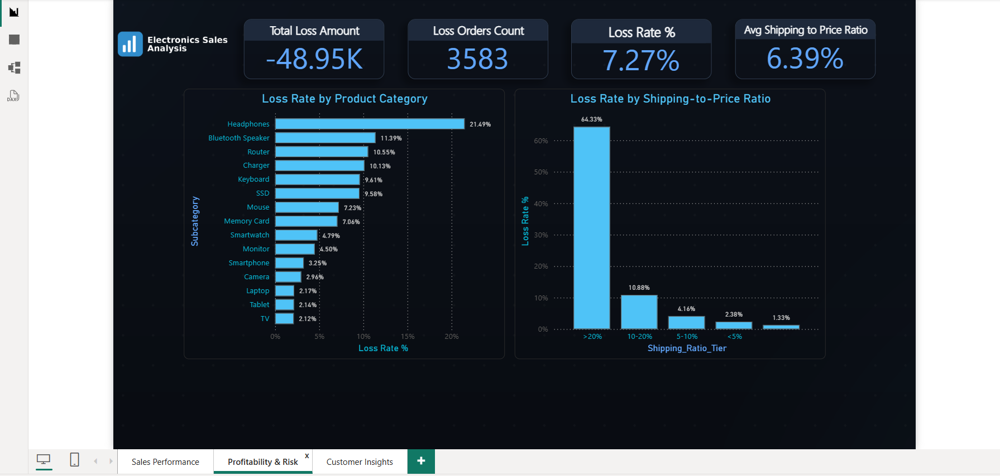
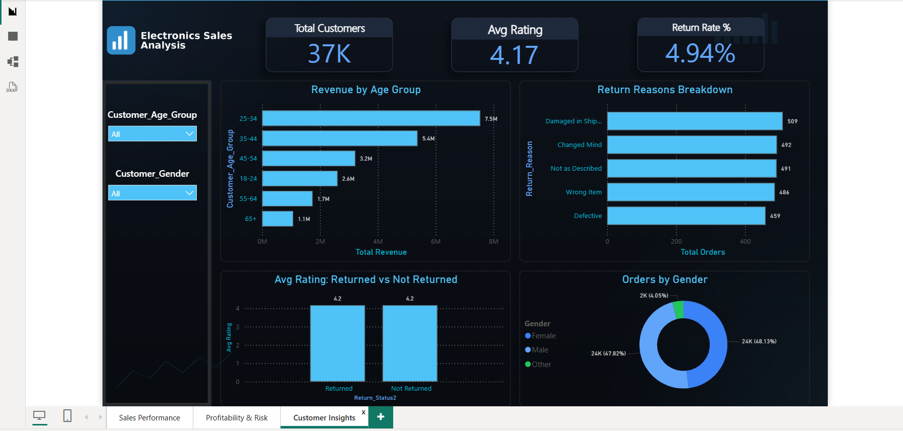

# 📊 Electronics Sales Data Analysis

An end-to-end data analysis project on 49,316 electronics sales orders spanning January–December 2025 — from raw data cleaning to an interactive Power BI dashboard.

## 🎯 Objective

Understand sales and profitability performance across product categories, regions, and customer segments, and uncover hidden operational issues affecting margins.

## 🛠️ Tools

- **Python (Pandas)** — data cleaning, feature engineering, exploratory data analysis
- **Power BI** — interactive 3-page dashboard
- **DAX** — KPI measures and calculated columns

## 🔍 Key Finding

The most significant discovery: **the ratio of shipping cost to product price**, not the shipping method itself, is the real driver of order-level losses.

| Shipping-to-Price Ratio | Loss Rate |
|---|---|
| < 5% | 2.38% |
| 5–10% | 4.16% |
| 10–20% | 10.88% |
| **> 20%** | **64.33%** |

When shipping cost exceeds 20% of a product's base price, the probability of that order being unprofitable jumps to over 64%.

## 📈 Other Findings

- **Headphones** is the weakest category by margin (11.8% avg profit margin, 21.5% loss rate)
- No meaningful profitability difference between regions — the issue is product-driven, not geographic
- The **25–34 age group** drives the largest share of revenue and order volume
- No correlation between product rating and return likelihood — return reasons are evenly distributed across 5 categories

## 📁 Project Structure

```
├── data/
│   └── final_dashboard_data.csv       # cleaned & feature-engineered dataset
├── notebooks/
│   └── Elec-sales.ipynb               # full cleaning + EDA workflow
├── dashboard/
│   └── sales_dashboard.pbix           # Power BI file (3 pages)
├── report/
│   └── Executive_Summary_Report.docx  # written findings & recommendations
└── README.md
```

## 📊 Dashboard Pages

### **1️⃣ Sales Performance**
High-level sales and profit KPIs, monthly trend, category and regional breakdown.  
![Sales Performance]/assets/Customer_Insights.png


### **2️⃣ Profitability & Risk**
The shipping-to-price ratio discovery, loss analysis by category.  


### **3️⃣ Customer Insights**
Revenue by age group, gender split, return reason breakdown.  



## 🧹 Methodology

1. **Data Cleaning** — removed corrupted rows, validated data types, handled missing values with context-aware logic (distinguishing "missing = error" from "missing = valid information")
2. **Feature Engineering** — extracted date components, profit margin tiers, shipping-to-price ratio
3. **Exploratory Data Analysis** — grouped analysis across category, region, shipping method, and demographics
4. **Dashboard Build** — 3-page interactive Power BI report with DAX measures and slicers

## 💡 Recommendations

- Introduce a dynamic shipping pricing policy: flag any product where shipping cost exceeds 20% of base price
- Reassess pricing or shipping negotiation for the Headphones category specifically
- Prioritize marketing and loyalty programs toward the 25–34 age segment
- Treat return reasons individually rather than relying on product rating as an early warning signal

---

*Built as a hands-on data analysis project covering the full pipeline: cleaning → feature engineering → EDA → dashboard → reporting.*
